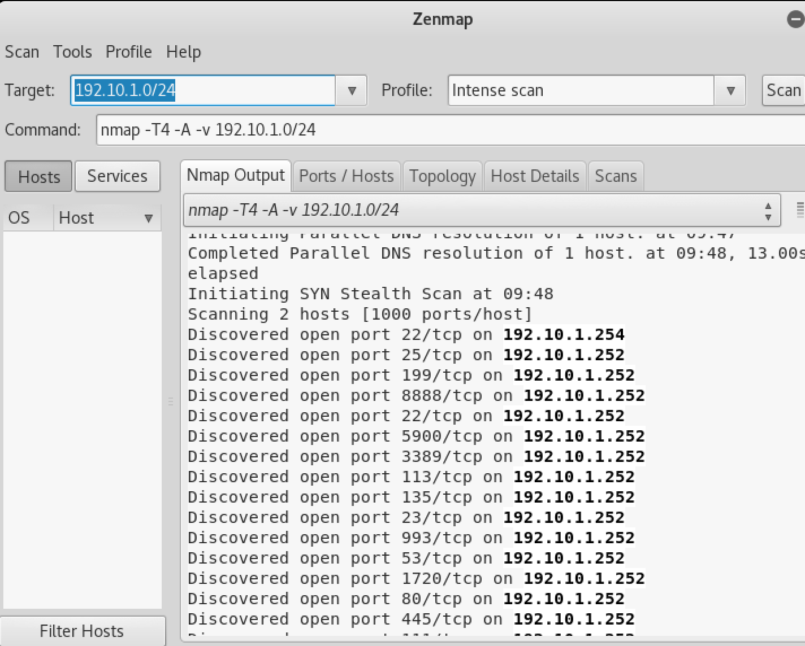
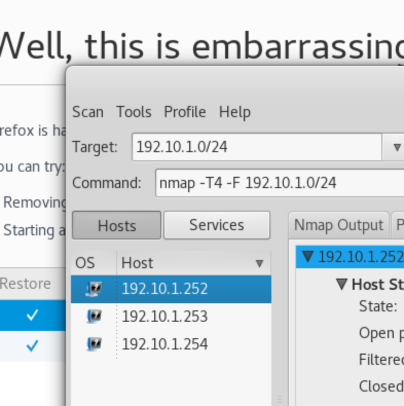
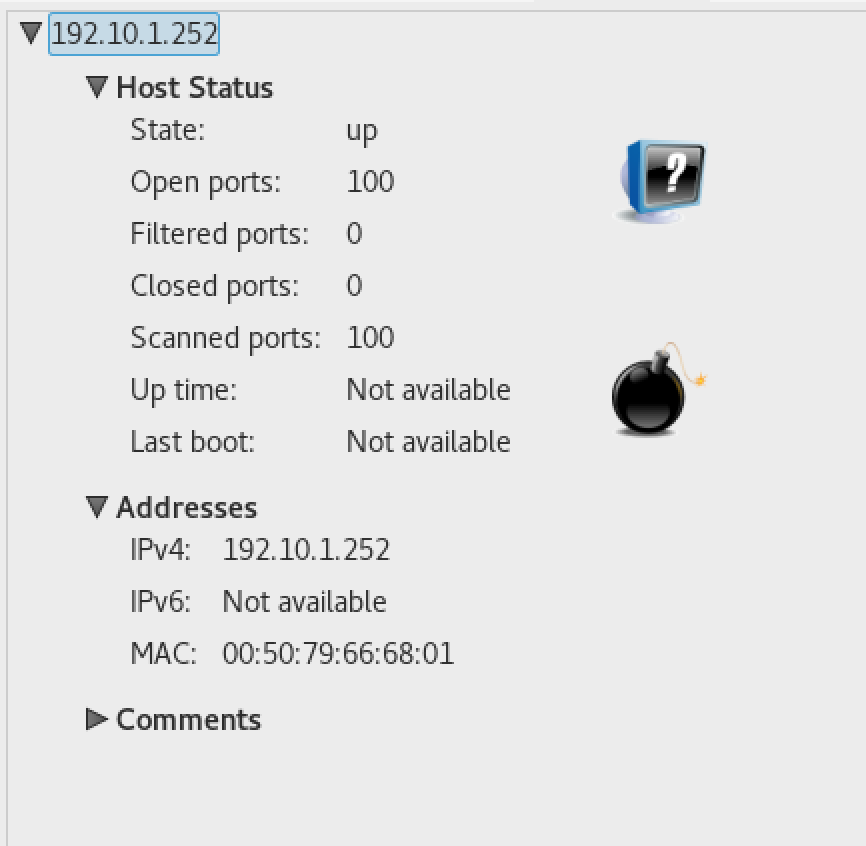
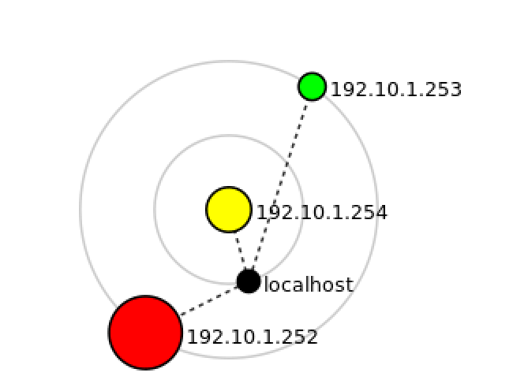

Performing nmap using zenmap

nmap -T4 -A -v 192.10.1.0/24

**Results**
* Confirmed VPC found

192.10.1.252

* Vulnerabilities

- Quick scan
nmap -T4 -F 192.10.1.0/24

Host is up (0.0035s latency).
Not shown: 95 closed ports
PORT     STATE SERVICE
21/tcp   open  ftp
22/tcp   open  ssh
23/tcp   open  telnet
80/tcp   open  http
2000/tcp open  cisco-sccp
MAC Address: 00:53:3E:F4:7F:02 (Unknown)

- Topology

