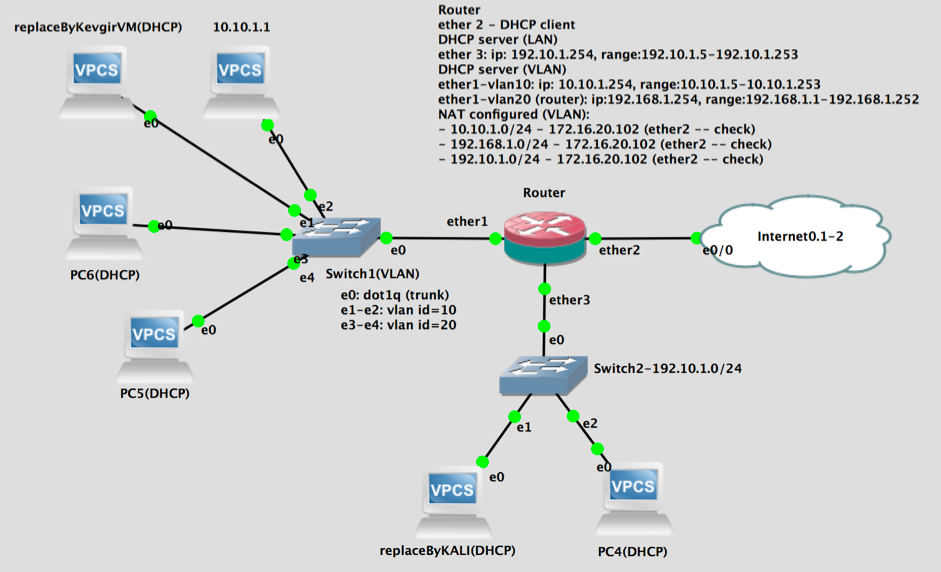

Guide: https://mop.cv.uma.es/mod/resource/view.php?id=428997

For each of the gns3 projects described above (the following steps should not be included in the memory):
1.	Download the network file using the link (the GNS3 project)
2.	[OPTIONAL, Internet is not required in this practical session] Check the “Internet” connection. Probably the student will have to re-configure NAT in the router connected to the “Internet” element (read the description of the files).
3.	Edit the project (using a text editor) in order to change the server for the network elements. It has been exported as “local” but must be “vm” in order to use the server in GNS3 VM (instructions in the student’s Guide).
4.	Check the connection of the network elements, and check some protocols, such as DHCP.
5.	Ensure that the virtual machines are listed by the corresponding virtual platform: VMware player or/and VMware fusion (instructions in the student’s Guide). 
6.	**Create a template** (if this does not exist) for the virtual machines in order to be used in GNS3 (instructions in the student’s Guide)
7.	Replace the VPCS marked with the red box by the corresponding virtual machines.  
8.	Test the network connection of the virtual machines.

